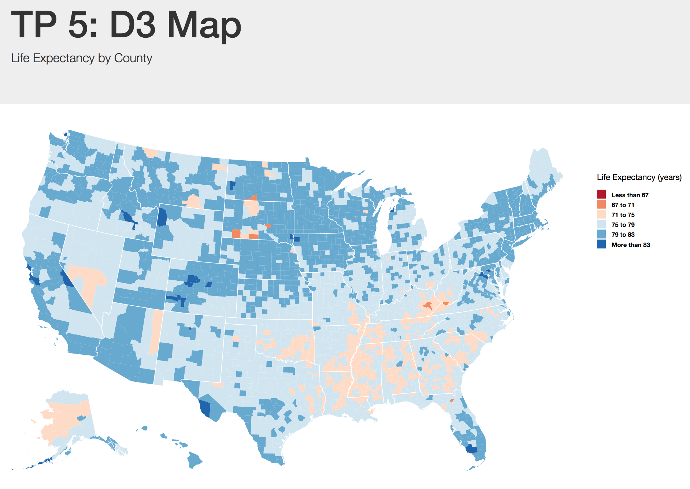
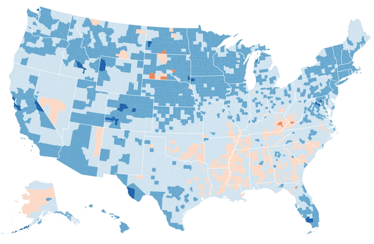

# tp5-map

For the fifth (and final!) technical progress check-in, you'll be using the [D3](https://d3js.org/) framework to build a choropleth map. In doing so, you'll demonstrate a strong familiarity with the following skills:

- Using **topojson** to build a map of the U.S.
- Using data to drive transitions
- Using [d3-legend](http://d3-legend.susielu.com/) to build a legend for your map

## Preview
Complete example of visualization.



And you'll create the following animation that **transitions color based on life expectancy**:



## Dataset
This assignment uses a data set from a recent paper by the Institute for Health Metrics and Evaluation assessing differences in life expectancy for U.S. counties. The data was downloaded [here](http://ghdx.healthdata.org/us-data), and you can learn more about the project [here](http://www.healthdata.org/news-release/growing-gap-between-longest-and-shortest-lifespans-us-emphasizes-need-policy-action).

The shapefile that you want to use in your project is at the URL `https://d3js.org/us-10m.v1.json` (you can load it directly from the URL into your project). It has **already been projected**, so you don't need to worry about specifying a projection. 

## Instructions
Instructions are included below, as well as in-line in your `js/script.js` file. I suggest that you borrow many approaches from [this example](https://bl.ocks.org/mbostock/4060606) (feel free to use `gistclone` to download it if you like). I've already included suggested libraries in your `index.html` file.

### Data Prep
You'll need to load _both_ your shapefile _and_ the life expectancy data, which I suggest you do using `d3.queue` (see example above for implementation). When you load the data, you'll need to make a few formatting accommodations:

- The life expectancy of each county is in a format that includes the uncertainty (i.e., each value is `VALUE (LOWER.BOUND, UPPER.BOUND)`). You'll need to iterate through the dataset and extract _just_ the quantitative value of interest (I suggest using the string `.split` method to grab the information of interest).
- The `FIPS` code (county identifier) has an error as a result of being saved via excel. Any county code that began with the number 0 (i.e., `03040`) has lost the leading zero. Luckily, the logic to fix this is simple: for any FIPS code that is 4 characters long, put a leading zero in front of it.
- The dataset includes state and national estimates, which you'll want to exclude (i.e., only include rows where the FIPS code is 5 characters long).

### Scaling
For your map, you'll want to use a color encoding to express live expectancy. I suggest that you use a `d3.scaleThreshold` function to create your scale. In the screenshots provided, I'm using the color scheme `d3.schemeRdBu[6]`, though you can choose an alternate. You'll need to compute your desired **domain** to correspond to the color **range**. Your domain will have the desired steps for you to use in your map, which you should **compute from your data**. For example, I'm computing 5 steps between my minimum and maxiumum value.

### Drawing your Map
Here, you'll use the data-join process to append a `path` element for each county in your shapefile. You can get the counties out of your TopoJSON file by using this line of code:

```javascript
topojson.feature(us, us.objects.counties).features
```

For each element in the array returned by that function, you'll need to append a `path` element and draw it using a function returned by `d3.geoPath()`.

### Transition
You should use your data values to transition the `fill` of each county. You should set a `delay` such that you first transition the counties with a shorter life expectancy, and then those with a longer life expectancy. You can use any approach you like to do this, though I was able to implement it by simply using the data values and a multiplier.

### D3 Legend
Susie Lu's [d3-legend](http://d3-legend.susielu.com/) library provides an excellent way to easily create legends. There is a very straightforward implementation presented in the [documentation](http://d3-legend.susielu.com/#color-threshold) for a threshold scale. However, you may have to remove this line of code: `.useClass(true)`. 
